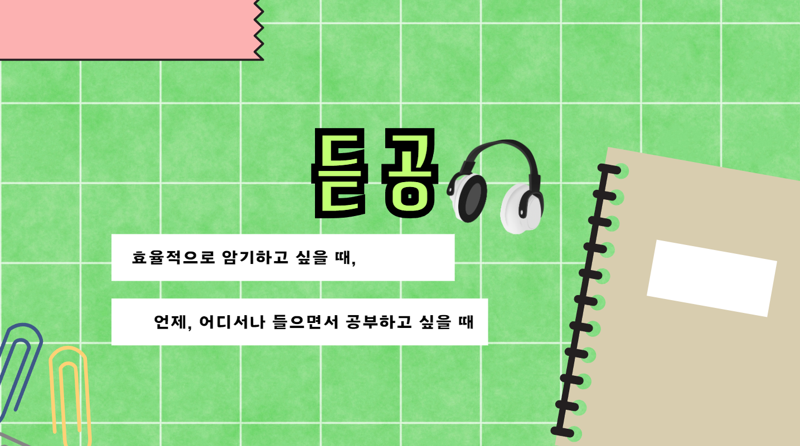

# 듣는 공부 - 듣공

## 👍 기획 배경

"더 나은 학습을 위한 두 가지 발견"

### 📚 읽기만이 답은 아니다!

- 읽기와 듣기의 학습 효과가 대등 (워털루 대학교 연구진) &rArr; 듣기를 통한 학습 제공

### 🧠 암기의 비밀을 찾다

- 뛰어난 기억력은 타고나는 것이 아닌 전략의 산물 (Nature Neuroscience 연구진) &rArr; 효율적으로 암기할 수 있는 방법 제공

## 💡 기능 소개

### 🔍 자료 학습 지원

- 사용자가 업로드한 학습 자료를 AI가 분석하여 핵심 요약본 제공
- 키워드만 입력해도 관련 학습 자료 자동 생성 및 제공

### 📝 학습 효율 최적화

- 목차 기반 원하는 부분 선택 청취
- 학업 성취도 향상을 위한 퀴즈 형식의 학습 제공
- 연상 암기 모드와 시험 5분전 모드 제공

### 🎧 듣기 학습 기능

- 반복 청취를 통한 암기력 향상
- 학습에 효과적인 음성 제공
- 백그라운드 재생 지원으로 언제 어디서나 학습 가능

## 💻 Stacks

### Frontend

### Backend

### Infra

### ETC

## ▶️ 시연 영상

(이미지를 누르면 영상 링크로 이동합니다.)

## 팀원 소개

|                                             심재운                                              |                                             이주형                                              |                                             고동연                                              |                                             정재영                                              |                                             정기영                                              |                                             조민우                                              |
| :---------------------------------------------------------------------------------------------: | :---------------------------------------------------------------------------------------------: | :---------------------------------------------------------------------------------------------: | :---------------------------------------------------------------------------------------------: | :---------------------------------------------------------------------------------------------: | :---------------------------------------------------------------------------------------------: |
|                                              역할                                               |                                              역할                                               |                                              역할                                               |                                              역할                                               |                                              역할                                               |                                            음성재생                                             |
|                       [여기 채워야함](https://github.com/FlashingFuture)                        |                       [여기 채워야함](https://github.com/FlashingFuture)                        |                       [여기 채워야함](https://github.com/FlashingFuture)                        |                       [여기 채워야함](https://github.com/FlashingFuture)                        |                       [FlashingFuture](https://github.com/FlashingFuture)                       |                             [mauercho](https://github.com/mauercho)                             |
|  |  |  |  |  |  |
